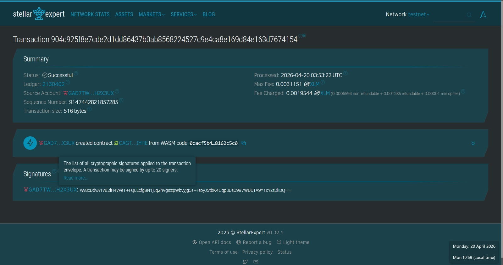

# Student Library dApp 📚

A decentralized library management system on Stellar Testnet.

## Features
- [cite_start]Add books to blockchain [cite: 105, 107]
- [cite_start]List all library records [cite: 105, 113]
- [cite_start]Borrow and Return system [cite: 105, 107]

## Technical Details
- [cite_start]Network: Stellar Testnet [cite: 131, 132]
- [cite_start]Smart Contract: Soroban (Rust) [cite: 73, 76, 79]
- Contract ID: CAGTQ5KINP2DOFHIAXNWVD4I44DF5NTJ33YRHUPIZVPMS3DXSAHFIYHE

## Screenshot
